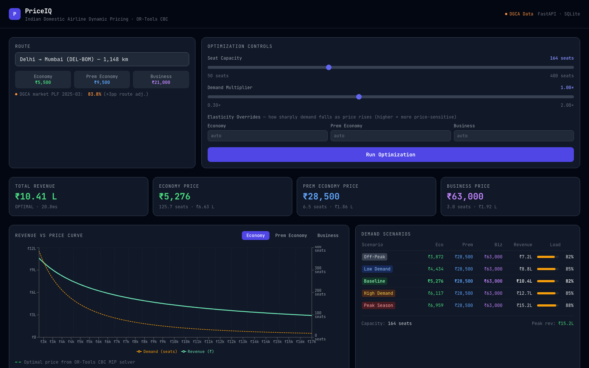

# PriceIQ ✈️

**Dynamic pricing for Indian domestic airline routes** — a revenue-management decision-support tool that prices three cabin classes jointly with a mixed-integer program (OR-Tools CBC), over demand curves grounded in real DGCA market statistics.

[](https://github.com/Gutta09/priceIQ/actions/workflows/ci.yml)
[](LICENSE)



## What it does

Pick one of the 8 busiest Indian domestic routes (DEL-BOM, DEL-BLR, …) and PriceIQ:

- **Optimizes fares jointly** for Economy / Premium Economy / Business using a CBC mixed-integer program — the shared aircraft-capacity constraint couples the classes, which is what makes this a joint optimization rather than three independent 1-D searches
- **Simulates demand scenarios** (off-peak → peak season) and shows how optimal prices, revenue, and load factor shift
- **Reports real airline RM KPIs**: RASK, PRASK, yield per RPK, load factor — per flight and per cabin
- **Calibrates demand curves** by log-log OLS against a 90-day booking history, correctly discarding sold-out (censored) observations — the classic RM *unconstraining* problem
- **Shows the real DGCA market context**: monthly passenger load factor trend and city-pair traffic volumes

## Data provenance — what's real and what's simulated

Honesty matters more than impressive-sounding claims, so precisely:

| Data | Status | Source |
|---|---|---|
| Monthly market PLF (2024–2025) | **Real, exact values** | DGCA monthly reports via [Vonter/india-aviation-traffic](https://github.com/Vonter/india-aviation-traffic) |
| City-pair monthly passengers | **Real, exact values** | DGCA city-pair dataset (windows differ per route — that's how DGCA publishes them) |
| Fare levels & cabin mix | Realistic (public 2024-25 fare ranges; 132Y/24W/8J three-class A320neo) | Airline websites / fleet data |
| 90-day booking history | **Synthetic** — generated from the constant-elasticity model, demand *level* anchored to real DGCA PLF | `backend/data.py` |

Because the booking generator and the calibration model share the same functional form, the calibration demo is a **parameter-recovery simulation study**: it demonstrates that the estimation pipeline recovers known elasticities from noisy, censored observations (avg R² ≈ 0.90 after censoring treatment). It is *not* an estimate of real Indian fare elasticities. Plug real bookings into the `historical_bookings` table and the identical pipeline estimates real parameters.

## The optimization model

For each fare class *c* with base price *p₀*, base demand *D₀*, and elasticity *e*, demand follows a constant-elasticity curve, truncated at cabin capacity *K_c*:

```
D_c(p) = min( D₀ · m · (p/p₀)^(−e) ,  K_c )        m = demand multiplier
```

Prices are restricted to 50 candidates per class on `[0.5·p₀, 3·p₀]`. Binary variable `x[c][k]` selects candidate *k* for class *c*:

```
max  Σ_c Σ_k  p_k · D_c(p_k) · x[c][k]           (total expected revenue)
s.t. Σ_k x[c][k] = 1                ∀c           (one price per class)
     Σ_c Σ_k D_c(p_k) · x[c][k] ≤ K_total        (aircraft capacity)
     x[c][k] ∈ {0,1}
```

Solves in ~5–15 ms with CBC; results are cached (deterministic inputs → LRU cache).

**Known model limitations** (deliberate scope cuts, good interview questions):

- Constant-elasticity demand with *e* < 1 has revenue monotonically increasing in price, so inelastic cabins (Business) always price at the ceiling — real RM systems use richer demand models (logit, exponential) with interior optima
- Demand is deterministic expected value; no stochastic demand, no booking-curve dynamics over time
- No cross-class substitution (a priced-out Business traveller doesn't buy up Premium Economy)

## Architecture

```
frontend/  React 19 + Vite + Tailwind + Recharts   (SPA, dark dashboard)
backend/   FastAPI + OR-Tools CBC + SQLite
             data.py         DGCA data, route seeds, synthetic booking generator
             optimizer.py    MIP formulation + LRU-cached solves
             calibration.py  log-log OLS with censoring treatment
             main.py         HTTP layer (sync endpoints → threadpool, so a
                             10s solve can never block the event loop)
             tests/          27 pytest cases: solver invariants, parameter
                             recovery, API contracts
```

In production FastAPI serves the built SPA at the same origin — one process, no CORS, no proxy.

## Run it

**Local (Python 3.11+ and Node 20+):**

```bash
./build.sh            # builds frontend, installs backend deps, starts on :8000
```

**Dev mode (hot reload):**

```bash
cd backend  && pip install -r requirements-dev.txt && uvicorn main:app --reload   # :8000
cd frontend && npm ci && npm run dev                                              # :5173, proxies /api
```

**Docker:**

```bash
docker compose up --build   # single image, SQLite on a named volume, :8000
```

**Tests:**

```bash
cd backend && python -m pytest tests -q
```

**Deploy:** `render.yaml` is a one-click Render blueprint (free tier).

## API

| Endpoint | What it does |
|---|---|
| `GET /routes` | Routes with fares, cabin mix, demand params, DGCA metadata |
| `POST /optimize` | Joint MIP solve — body: `route_id`, optional capacity (50–500), demand multiplier (0.1–5), per-class elasticity overrides |
| `GET /scenarios?route_id=` | Five demand scenarios, optimized independently |
| `GET /metrics/{route_id}` | RASK / PRASK / yield / load factor, per cabin |
| `POST /calibrate?route_id=` | Log-log OLS parameter recovery, R²/RMSE per class |
| `GET /dgca` | Embedded real DGCA PLF series and city-pair volumes |
| `GET /health` | Health probe |

Interactive docs at `/docs` (Swagger UI) when running.

## Roadmap

- Per-class price ceilings informed by competitor fares (fixes the ceiling-pricing artifact for inelastic cabins)
- Scenario comparison view + CSV export
- Stochastic demand (booking-curve simulation over the selling horizon)
- Persist calibration runs and uploaded booking CSVs (give SQLite a real job)

## License

[MIT](LICENSE) · DGCA data via [Vonter/india-aviation-traffic](https://github.com/Vonter/india-aviation-traffic) (thank you!)
